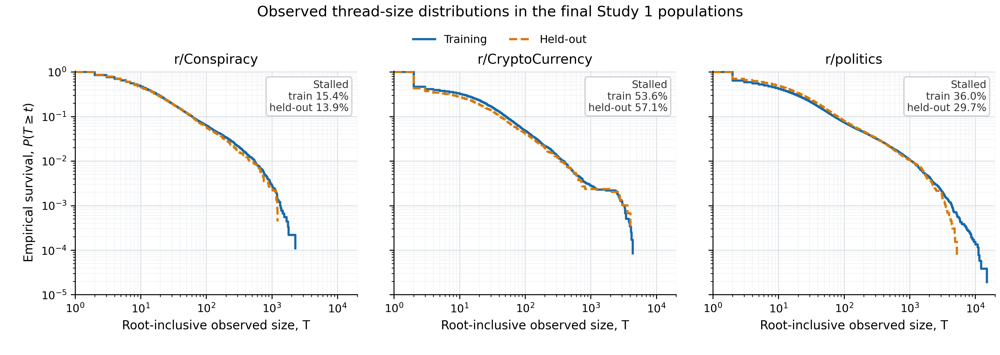

# Study 1 observed thread-size distribution audit

## Audit conclusion

**Ready within reviewed scope.** The exact final eligible populations are 11,395 r/Conspiracy roots, 14,818 r/CryptoCurrency roots, and 65,343 r/politics roots. Their training/held-out counts, stalled/started counts, and four-class distributions reconcile exactly with the final preprocessing logs, selected-model class tables, and thesis-facing publication ratios. All 63 automated checks pass.

This is an audit of **observed size within finite archived coverage**, not eventual thread size. `C` is the number of retained descendant-comment rows and `T = 1 + C` includes the root. A stalled root has `C = 0` and `T = 1`; a started root has `C >= 1` and `T >= 2`.

The earlier validated probability-calibration audit supplies reliable partition and class-range evidence but not these raw distribution summaries or this CCDF. No older plot was reused.

## Population and stalled prevalence

| Subreddit        | Partition | Eligible roots | Stalled n | Stalled % | Started n |
| ---------------- | --------- | -------------- | --------- | --------- | --------- |
| r/Conspiracy     | full      | 11395          | 1720      | 15.09     | 9675      |
| r/Conspiracy     | training  | 9116           | 1404      | 15.40     | 7712      |
| r/Conspiracy     | held-out  | 2279           | 316       | 13.87     | 1963      |
| r/CryptoCurrency | full      | 14818          | 8048      | 54.31     | 6770      |
| r/CryptoCurrency | training  | 11854          | 6356      | 53.62     | 5498      |
| r/CryptoCurrency | held-out  | 2964           | 1692      | 57.09     | 1272      |
| r/politics       | full      | 65343          | 22690     | 34.72     | 42653     |
| r/politics       | training  | 52274          | 18814     | 35.99     | 33460     |
| r/politics       | held-out  | 13069          | 3876      | 29.66     | 9193      |

## Started-root statistics

Percentiles use the Hyndman-Fan type 7 definition (pandas linear interpolation). Thus an interpolated percentile need not itself be an observed integer. The frozen CSV retains 15 significant digits. Because `T = C + 1`, every started-root `T` statistic is exactly one larger than its `C` counterpart.

### Descendant comments, C, among started roots

| Population                  | N      | Stalled n | Stalled % | Started n | Min | Q1 | Median | Q3    | P90   | P95    | P99      | Mean  | Max    |
| --------------------------- | ------ | --------- | --------- | --------- | --- | -- | ------ | ----- | ----- | ------ | -------- | ----- | ------ |
| r/Conspiracy — full         | 11,395 | 1,720     | 15.09     | 9,675     | 1   | 4  | 10     | 25.50 | 68    | 148    | 570.78   | 37.83 | 2,271  |
| r/Conspiracy — training     | 9,116  | 1,404     | 15.40     | 7,712     | 1   | 4  | 10     | 26    | 69    | 154    | 574.78   | 38.70 | 2,271  |
| r/Conspiracy — held-out     | 2,279  | 316       | 13.87     | 1,963     | 1   | 4  | 9      | 25    | 65    | 133    | 528.28   | 34.41 | 1,213  |
| r/CryptoCurrency — full     | 14,818 | 8,048     | 54.31     | 6,770     | 1   | 6  | 17     | 41    | 101   | 187    | 603.31   | 58.00 | 4,366  |
| r/CryptoCurrency — training | 11,854 | 6,356     | 53.62     | 5,498     | 1   | 6  | 18     | 42    | 103   | 185.30 | 604.81   | 58.86 | 4,366  |
| r/CryptoCurrency — held-out | 2,964  | 1,692     | 57.09     | 1,272     | 1   | 4  | 15     | 37    | 95.80 | 188    | 601.58   | 54.29 | 4,021  |
| r/politics — full           | 65,343 | 22,690    | 34.72     | 42,653    | 1   | 5  | 16     | 41    | 118   | 298.40 | 1,459.44 | 83.80 | 15,052 |
| r/politics — training       | 52,274 | 18,814    | 35.99     | 33,460    | 1   | 5  | 15     | 41    | 118   | 304    | 1,450    | 85.76 | 15,052 |
| r/politics — held-out       | 13,069 | 3,876     | 29.66     | 9,193     | 1   | 6  | 17     | 43    | 115   | 278.40 | 1,480.32 | 76.67 | 5,249  |

### Root-inclusive size, T, among started roots

| Population                  | N      | Stalled n | Stalled % | Started n | Min | Q1 | Median | Q3    | P90   | P95    | P99      | Mean  | Max    |
| --------------------------- | ------ | --------- | --------- | --------- | --- | -- | ------ | ----- | ----- | ------ | -------- | ----- | ------ |
| r/Conspiracy — full         | 11,395 | 1,720     | 15.09     | 9,675     | 2   | 5  | 11     | 26.50 | 69    | 149    | 571.78   | 38.83 | 2,272  |
| r/Conspiracy — training     | 9,116  | 1,404     | 15.40     | 7,712     | 2   | 5  | 11     | 27    | 70    | 155    | 575.78   | 39.70 | 2,272  |
| r/Conspiracy — held-out     | 2,279  | 316       | 13.87     | 1,963     | 2   | 5  | 10     | 26    | 66    | 134    | 529.28   | 35.41 | 1,214  |
| r/CryptoCurrency — full     | 14,818 | 8,048     | 54.31     | 6,770     | 2   | 7  | 18     | 42    | 102   | 188    | 604.31   | 59.00 | 4,367  |
| r/CryptoCurrency — training | 11,854 | 6,356     | 53.62     | 5,498     | 2   | 7  | 19     | 43    | 104   | 186.30 | 605.81   | 59.86 | 4,367  |
| r/CryptoCurrency — held-out | 2,964  | 1,692     | 57.09     | 1,272     | 2   | 5  | 16     | 38    | 96.80 | 189    | 602.58   | 55.29 | 4,022  |
| r/politics — full           | 65,343 | 22,690    | 34.72     | 42,653    | 2   | 6  | 17     | 42    | 119   | 299.40 | 1,460.44 | 84.80 | 15,053 |
| r/politics — training       | 52,274 | 18,814    | 35.99     | 33,460    | 2   | 6  | 16     | 42    | 119   | 305    | 1,451    | 86.76 | 15,053 |
| r/politics — held-out       | 13,069 | 3,876     | 29.66     | 9,193     | 2   | 7  | 18     | 44    | 116   | 279.40 | 1,481.32 | 77.67 | 5,250  |

## Corresponding all-root statistics

All-root summaries are interpretable as the observed mixture including stalled roots; they therefore have minima `C=0` and `T=1`. They should not be substituted for the started-root conditional summaries.

### Descendant comments, C, across all roots

| Population                  | N      | Stalled n | Stalled % | Started n | Min | Q1 | Median | Q3    | P90 | P95    | P99      | Mean  | Max    |
| --------------------------- | ------ | --------- | --------- | --------- | --- | -- | ------ | ----- | --- | ------ | -------- | ----- | ------ |
| r/Conspiracy — full         | 11,395 | 1,720     | 15.09     | 9,675     | 0   | 2  | 7      | 21    | 59  | 124    | 532.06   | 32.12 | 2,271  |
| r/Conspiracy — training     | 9,116  | 1,404     | 15.40     | 7,712     | 0   | 2  | 7      | 21    | 59  | 126    | 542.55   | 32.74 | 2,271  |
| r/Conspiracy — held-out     | 2,279  | 316       | 13.87     | 1,963     | 0   | 2  | 7      | 20.50 | 59  | 111.20 | 442.08   | 29.64 | 1,213  |
| r/CryptoCurrency — full     | 14,818 | 8,048     | 54.31     | 6,770     | 0   | 0  | 0      | 15    | 47  | 91.15  | 368.32   | 26.50 | 4,366  |
| r/CryptoCurrency — training | 11,854 | 6,356     | 53.62     | 5,498     | 0   | 0  | 0      | 16    | 49  | 94     | 381.88   | 27.30 | 4,366  |
| r/CryptoCurrency — held-out | 2,964  | 1,692     | 57.09     | 1,272     | 0   | 0  | 0      | 11    | 39  | 78     | 335.37   | 23.30 | 4,021  |
| r/politics — full           | 65,343 | 22,690    | 34.72     | 42,653    | 0   | 0  | 5      | 24    | 71  | 169    | 1,063.74 | 54.70 | 15,052 |
| r/politics — training       | 52,274 | 18,814    | 35.99     | 33,460    | 0   | 0  | 4      | 23    | 69  | 165.35 | 1,062.81 | 54.90 | 15,052 |
| r/politics — held-out       | 13,069 | 3,876     | 29.66     | 9,193     | 0   | 0  | 8      | 28    | 78  | 175    | 1,062.60 | 53.93 | 5,249  |

### Root-inclusive size, T, across all roots

| Population                  | N      | Stalled n | Stalled % | Started n | Min | Q1 | Median | Q3    | P90 | P95    | P99      | Mean  | Max    |
| --------------------------- | ------ | --------- | --------- | --------- | --- | -- | ------ | ----- | --- | ------ | -------- | ----- | ------ |
| r/Conspiracy — full         | 11,395 | 1,720     | 15.09     | 9,675     | 1   | 3  | 8      | 22    | 60  | 125    | 533.06   | 33.12 | 2,272  |
| r/Conspiracy — training     | 9,116  | 1,404     | 15.40     | 7,712     | 1   | 3  | 8      | 22    | 60  | 127    | 543.55   | 33.74 | 2,272  |
| r/Conspiracy — held-out     | 2,279  | 316       | 13.87     | 1,963     | 1   | 3  | 8      | 21.50 | 60  | 112.20 | 443.08   | 30.64 | 1,214  |
| r/CryptoCurrency — full     | 14,818 | 8,048     | 54.31     | 6,770     | 1   | 1  | 1      | 16    | 48  | 92.15  | 369.32   | 27.50 | 4,367  |
| r/CryptoCurrency — training | 11,854 | 6,356     | 53.62     | 5,498     | 1   | 1  | 1      | 17    | 50  | 95     | 382.88   | 28.30 | 4,367  |
| r/CryptoCurrency — held-out | 2,964  | 1,692     | 57.09     | 1,272     | 1   | 1  | 1      | 12    | 40  | 79     | 336.37   | 24.30 | 4,022  |
| r/politics — full           | 65,343 | 22,690    | 34.72     | 42,653    | 1   | 1  | 6      | 25    | 72  | 170    | 1,064.74 | 55.70 | 15,053 |
| r/politics — training       | 52,274 | 18,814    | 35.99     | 33,460    | 1   | 1  | 5      | 24    | 70  | 166.35 | 1,063.81 | 55.90 | 15,053 |
| r/politics — held-out       | 13,069 | 3,876     | 29.66     | 9,193     | 1   | 1  | 9      | 29    | 79  | 176    | 1,063.60 | 54.93 | 5,250  |

## Proposed empirical CCDF

**Figure caption.** Empirical complementary cumulative distributions of root-inclusive observed thread size, `P(T >= t)`, for the chronological training and held-out populations in each subreddit. Both axes are logarithmic. Every plotted step comes from an observed integer `T` and the exact survivor numerator and partition denominator in `outputs/ccdf.csv`; no distributional model or power-law fit is shown. Stalled roots occur at `T=1` and comprise 15.09%, 54.31%, and 34.72% of the full r/Conspiracy, r/CryptoCurrency, and r/politics populations, respectively; split-specific prevalence is printed in each panel and tabulated above.

The long upper tails are descriptive features of these finite archived observations. This figure alone does not justify calling any distribution a power law.

## Required verification results

1. **Population and class reconciliation — pass.** Full populations equal training plus held-out populations exactly. Selected-model training and held-out class counts are reproduced row for row: r/Conspiracy `1404/2625/2532/2555` and `316/706/631/626`; r/CryptoCurrency `6356/1835/1853/1810` and `1692/510/386/376`; r/politics `18814/11717/10816/10927` and `3876/2921/3121/3151` for Stalled/Small/Medium/Large. The corresponding true-class shares equal the thesis-facing publication workbook to machine precision.
2. **Root-author self-comments — included.** Feature construction reads the comment parquet without an author-based exclusion and carries the pre-existing `thread_size` target forward. Direct raw-data aggregation shows `T = 1 +` all retained comment rows for every eligible root. Exact retained author equality identifies 30,362, 17,742, and 31,881 root-author comments, affecting 7,275, 3,257, and 14,170 roots. Excluding them would contradict the final `C` values for those roots.
3. **Infinite final edge — pass.** Replacing each finite upper bin edge by positive infinity changes zero assignments in all six final training/held-out partitions. The finite edge already exceeds the largest frozen target in its subreddit.
4. **No held-out determination of lower boundaries — pass.** `2_tuning.py` loads only the training outcome file before constructing the fixed lower edges from started-training quantiles. Hyperparameter tuning reuses those bins. Final evaluation loads held-out labels only after the boundaries exist; its sole possible boundary mutation is an extension of the final upper edge. Stored lower edges reproduce numerically from training labels alone for all three subreddits.

## Thesis-safe interpretation and limitations

- The archive observes retained Reddit records over finite collection coverage. It does not establish how large each thread eventually became after the archive stopped observing it.
- `C` counts retained descendant comment rows, including retained comments by the root author. It is not a count of unique commenters.
- Train/held-out differences are descriptive distribution shifts across later chronological records, not causal effects and not evidence of statistical significance.
- Linear-interpolated quantiles are conventional summaries; maxima and tail means are sensitive to a small number of very large observed threads.
- The repository checkout contains the final pipeline inputs, outputs, and prior audit records but not the thesis manuscript itself. Reconciliation therefore uses the final thesis-facing preprocessing and publication tables stored here.
- No formal tail-family comparison, goodness-of-fit test, or power-law analysis was performed. No such claim is supported by this package.

## Exact Chapter 4 and Appendix A recommendation

### Chapter 4 paragraph justified by this audit

> Thread size was measured over the finite archived coverage as `T = 1 + C`, where `C` is the number of retained descendant comments and the added unit is the root post. The final eligible populations contained 11,395 r/Conspiracy, 14,818 r/CryptoCurrency and 65,343 r/politics roots, divided chronologically into 9,116/2,279, 11,854/2,964 and 52,274/13,069 training/held-out observations. In the full populations, 15.09%, 54.31% and 34.72% of roots were stalled (`C=0`), respectively. Among started roots, median root-inclusive observed sizes were 11, 18 and 17; the corresponding means were 38.83, 59.00 and 84.80, reflecting long upper tails. These quantities describe archived observations rather than eventual thread size, and the empirical tail plots do not by themselves imply a power-law distribution.

### Chapter 4 table justified by this audit

Use one compact table with one row per subreddit × partition (full, training, held-out) and these columns: eligible roots; stalled `n (%)`; started roots; and, among started roots, `T` median `[Q1, Q3]`, P90, P95, P99, mean and maximum. This keeps the root-inclusive outcome used in the thesis visible while retaining the stalled mass. The exact source is `outputs/summary_statistics.csv`.

### Chapter 4 figure justified by this audit

Use `figures/thread_size_ccdf.svg` (or the 300-dpi PNG) with the caption above: three panels, training versus held-out empirical `P(T >= t)`, log-scaled axes, stalled prevalence disclosed, and no fitted tail law.

### Appendix A

Place the full paired `C` and `T` started-root and all-root tables, the quantile convention, exact class reconciliation, self-comment evidence, infinite-edge equivalence, held-out-leakage check, validation matrix, and provenance/hashes in Appendix A. These are necessary audit details but would overburden the Chapter 4 results narrative. `C` remains important in the appendix because it makes the stalled definition and descendant-only count explicit even though every `T` statistic is its one-unit translation.

## Files

- `outputs/summary_statistics.csv`: frozen full/training/held-out descriptive statistics.
- `outputs/ccdf.csv`: exact empirical CCDF points with frequencies, survivor numerators and denominators.
- `outputs/population_class_counts.csv`: recomputed four-class populations and shares.
- `outputs/self_comment_checks.csv`: aggregate author-comparability and self-comment evidence.
- `outputs/evidence_matrix.csv` and `outputs/validation_checks.csv`: claim-to-source matrix and automated results.
- `outputs/source_inventory.csv`, `outputs/run_record.json`, and `provenance.md`: hashes, versions and scope.
- `render_ccdf.py`: deterministic figure rendering from the two frozen aggregate CSV inputs.
